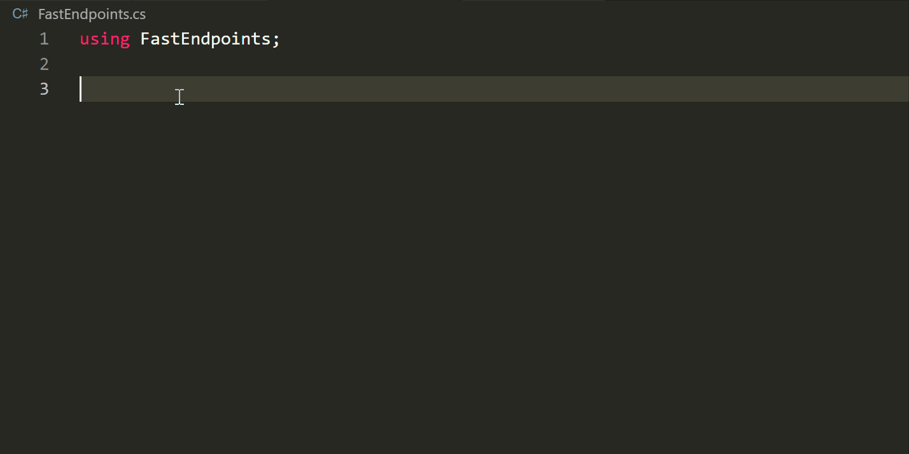

# FastEndpoints VS Code extension

This extension provides snippets for FastEndpoints ASP.NET Minimal APIs library.

Learn more about [FastEndpoints](https://github.com/FastEndpoints/FastEndpoints). 

## Usage

Type part of a snippet, choose snippet and press `TAB` to unfold the snippet.

### Snippets
| Snippet                      | Purpose                                                   |
| ---------------------------- | ----------------------------------------------------------|
| `fe_req`                     | Endpoint with Request only                                |
| `fe_reqres`                  | Endpoint with Request and Response                        |
| `fe_noreq`                   | Endpoint without Request                                  |
| `fe_res`                     | Endpoint without Request with Response                    |
| `fe_dtos`                    | Request & Response DTOs                                   |
| `fe_val`                     | Endpoint Validator                                        |
| `fe_map`                     | Endpoint Mapper                                           |
| `fe_sum`                     | Endpoint Summary                                          |
| `fe_full`                    | Set of classes for a full vertical slice                  |
| `fe_eh`                      | Event HandlerCommand without Result                       |
| `fe_cmd_nores`               | Command without Result                                    |
| `fe_cmd_res`                 | Command with Result                                       |
| `fe_cmd_handler_res`         | Command Handler with Result                               |
| `fe_cmd_handler_nores`       | Command Handler without Result                            |
| `fe_preproc`                 | Preprocessor                                              |
| `fe_postproc`                | Post Processor                                            |
| `fe_global_preproc`          | Global Preprocessor                                       |
| `fe_global_postproc`         | Global Post Processor                                     |
| `fe_test_fixture`            | Test Fixture                                              |
| `fe_test_class`              | Test Class                                                |
| `fe_test_method`             | Test Method                                               |

## Changelog

See [CHANGELOG](./CHANGELOG.md)

**Enjoy!**
